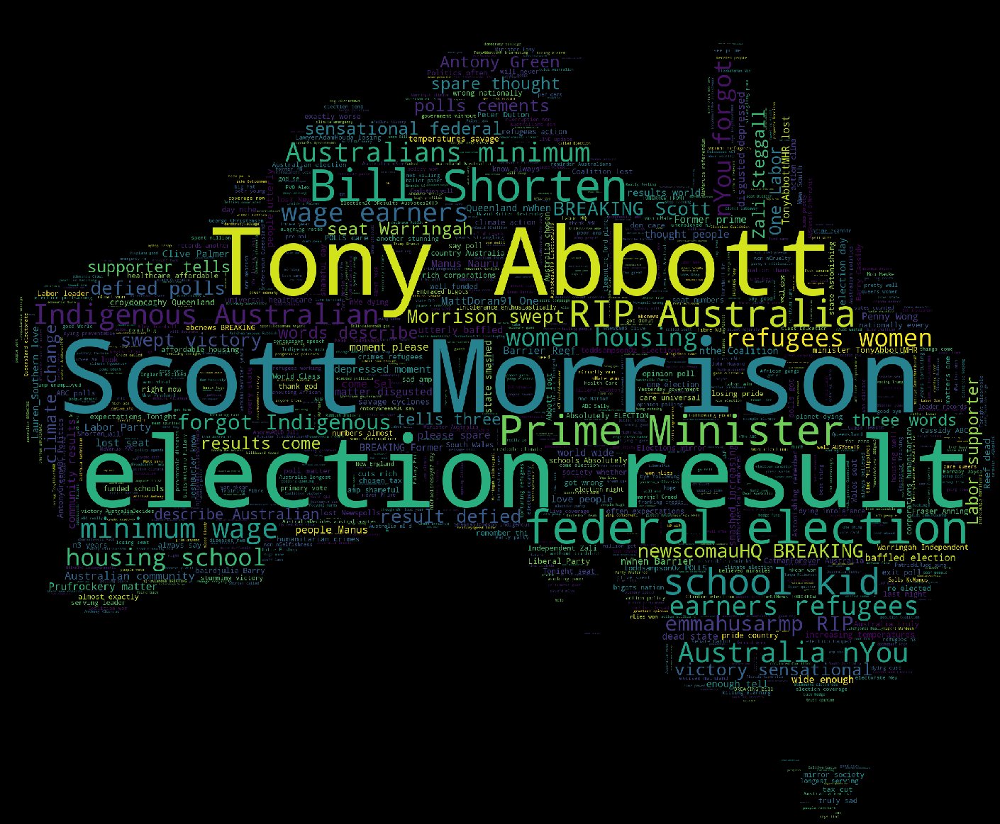
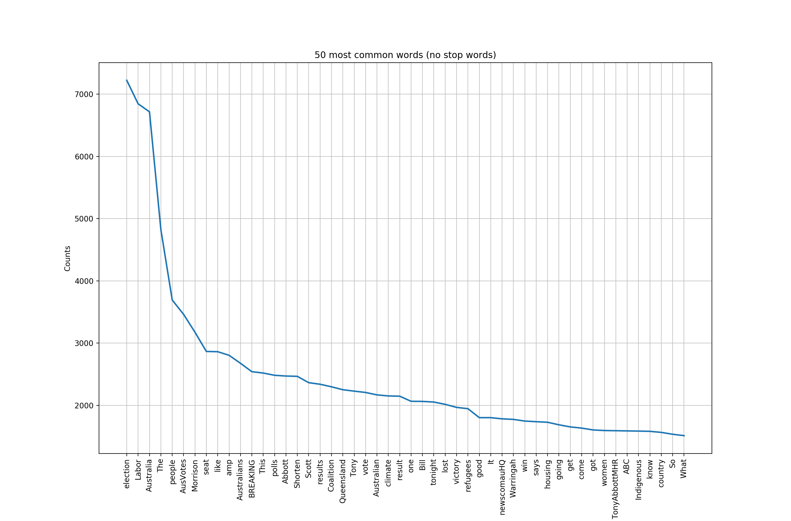
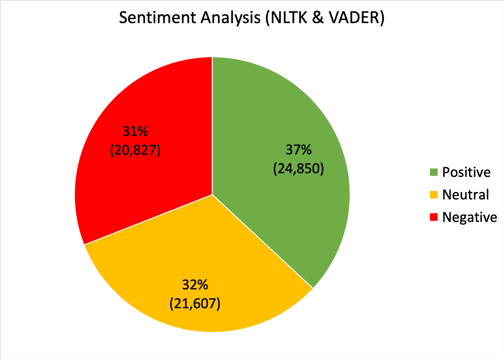

## #AUSVOTES '19

This is a collection of 67,284 public tweets containing the hashtag `#ausvotes`. The tweets were published between 6 pm on Saturday 18th May and 6pm Sunday 19th May (AEST). This 24 hour window was the time period when votes began to be tallied and the result of the election was declared.

### Word Cloud

### Word Frequency Distribution

### Sentiment Analysis

(Pie charts are still cool, _right?_)
